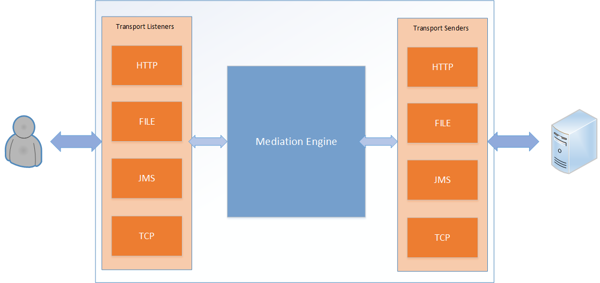
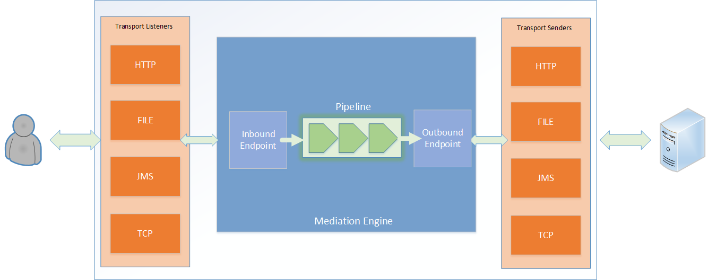
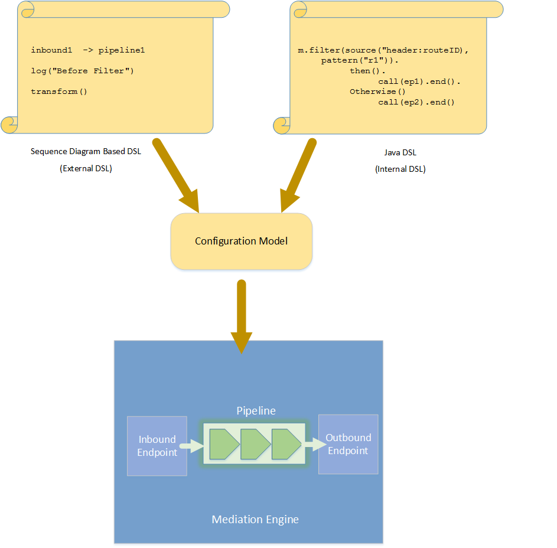

#WSO2 Gateway

This is a temporary repo for WSO2 Gateway work.

Gateway is a message-mediation-engine implementation that can receive/send Carbon-Messages 
from/to Carbon Transport and mediate messages. 

- Gateway Core runtime is configured via Gateway mediation language 
which can be visually represented in a sequence diagram-like design.   
- Lightweight, fully non-blocking mediation runtime. 
- Control Structures, Logging, Header and Content-based Routing, Type-aware messaging
- This runtime if fully extensible to built other advanced solutions such as Integration server (next-gen ESB), Data Integration Server, etc. 

Gateway Core cannot be used as a stand alone product/runtime. 

Building Gateway Framework
--------------------------

Build the master branch of this repository.
Can be built only from JDK 1.8.

Architecture
------------

 
<b>High Level Architecture</b>
 

  
<b>Engine Architecture</b>
 

  
<b>Configuration Model</b>
 

